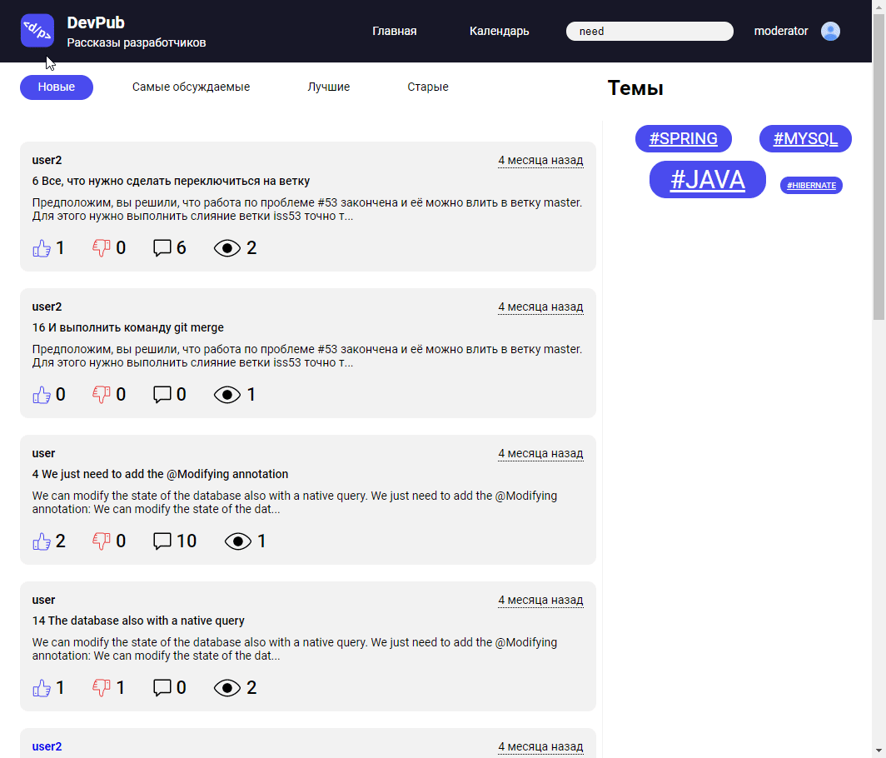

# Blog
**Итоговсая курсовая работа по курсу Skillbox Java-разработчик** 
Проект размещен на сервисе **heroku** https://blog-skillbox-dsh.herokuapp.com/

---

### Задание 
самостоятельно написать серверную часть блога с использованием фреймворка Spring

---

### Используемые технологии
Проект написан с использованием Spring Boot, Spring Security, Thymeleaf, MySql, FlyWay, 
Hibernate Validation, Lombok, JUnit, Imgscalr

---

### Возможности приложения
1. Регистрация, аутентификация и авторизация пользователей по ролям
2. Редактирование профиля пользователя
3. Востановление пароля через отправку сообщения с кодом на email пользователя
4. Публикация и редактирование статей (с картинками!)
5. Валидация данных отправляемых пользователями
6. Модерация статей
7. Просмотр статей с сортировкой по различным критериям: 
новые, старые, лучшие (по лайкам-дизлайкам), самые обсуждаемые (по комментариям)
8. Поиск статей по содержанию искомых слов в заголовке или тексте
9. Поиск статей по дате через календарь
10. Поиск по тегам с сортировкой тегов по "весу"
11. Добавление комментариев, лайков и дизлайков к статьям

---

### Как все это выглядит
